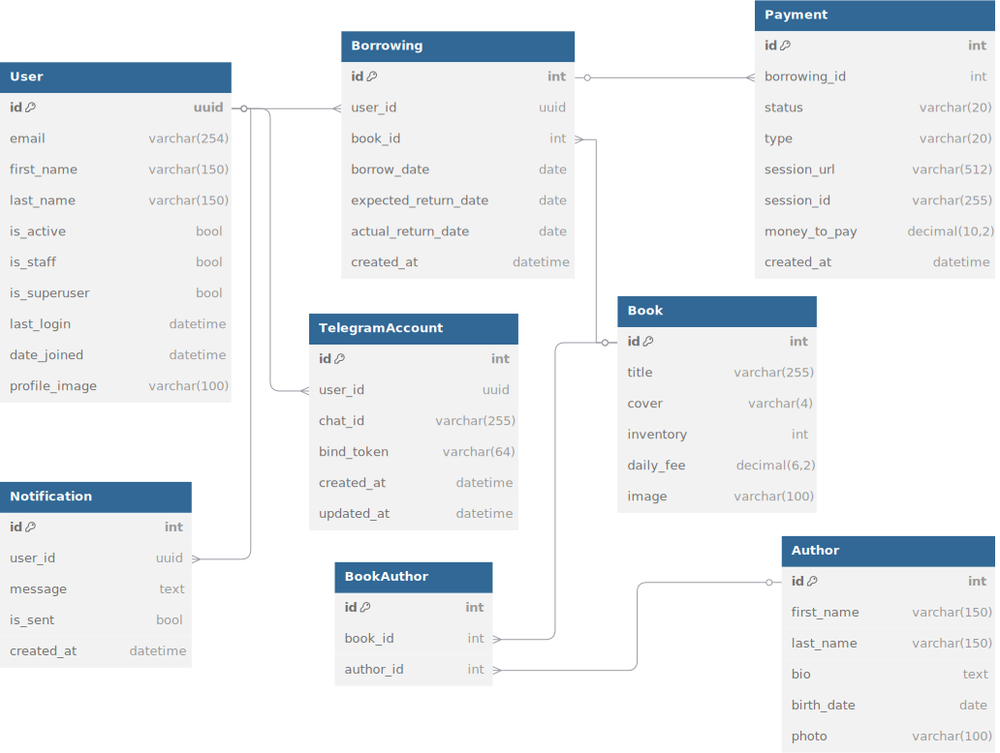

# 📚 Library Service API
**A REST API for managing an online library system built with Django and Django REST Framework with automated payment handling via Stripe, overdue fine processing, Telegram notifications, and asynchronous tasks using Celery**

---
## 📦 Features

### 🔐 Users Service
- Register & login with email
- JWT-based authentication
- Admin/user roles
- Custom JWT header (`Authorize`) for easier testing with ModHeader

### 📚 Books Service
- CRUD operations for books
- Admin-only: create/update/delete
- Everyone (even unauthenticated): list/view books

### 📖 Borrowings
- Users can borrow books if available
- Borrowing validation: no borrowing if inventory is 0
- Returns with automatic inventory update
- Daily overdue check (notifies via Telegram)
- Filtering by status/user (admin only)

### 💳 Payments
- Stripe session creation per borrowing
- Payment success/failure handling
- Fine calculation for late returns
- Pending payments prevent further borrowings

### 🤖 Telegram Bot
- Notifies on:
  - Get instant notifications about your books
  - Receive payment reminders
  - Stay updated with library events

- Available Commands:
  - /start - Start the bot
  - /info - Get bot information
  - /help - Show this help message
  - /get_chat_id - Get your chat ID
  - /tgregister - Link your account
  - /tgunregister - Unlink your account

    
### ⏱ Background Tasks
- Scheduled task to check overdue borrowings daily
- Stripe session monitoring (optional)
- Can use Celery
---
## 🛠 **Tech stack**

| Layer                     | Technology                                       |
|---------------------------|--------------------------------------------------|
| **Backend**               | Python 3.13 + Django 5.2 + Django REST Framework |
| **Database**              | PostgreSQL 15 (with PostGIS-ready)               |
| **Cache**                 | Redis                                            |
| **Auth**                  | JWT (Access/Refresh tokens)                      |
| **Payments**              | Stripe API                                       |
| **Background Jobs**       | Celery                                           |
| **Messaging**             | Telegram Bot API                                 |
| **Deployment**            | Docker + Docker Compose                          |
| **CI/CD**                 | GitHub Actions                                   |
| **Documentation**         | Swagger / Redoc via drf-spectacular              |
| **Linters & Formatters:** | `flake8`,`black`, `ruff`                         |

___

## 🗄 Database Structure 


---

## Installation

**1. Clone the repository:**

   ```bash
   git clone https://github.com/Sotnikov-100/library-service-api.git
   cd library-service-api
   ```

**2. Configure environment:**

   ```bash
   cp .env.example .env
   ```

**3. Build and start the containers:**
- Run the following command to build and start the containers:
   ```bash
     docker-compose up --build
   ```
**4. Create a superuser (optional, for admin panel access):**
- Open another terminal and run:

  ```bash
    docker-compose exec web python manage.py createsuperuser
    ```
Follow the prompts to create an admin user.

**5. Stopping the application:**
- Press `Ctrl+C` in the terminal where `docker-compose up` is running, then:

    ```bash
    docker-compose down
    ```
    To remove volumes (and lose PostgreSQL data):
    ```bash
    docker-compose down -v
    ```
## 🔐 Authentication

JWT access/refresh token based.

- Use `Authorize` header instead of `Authorization`.
- Easily configurable with [ModHeader](https://modheader.com/) Chrome extension.

---

## 📂 API Endpoints

### 👤 Users
- `POST /api/v1/users/register/` – Register new user
- `POST /api/v1/users/token/` – Obtain JWT tokens
- `POST /api/v1/users/token/refresh/` – Refresh JWT token
- `POST /api/v1/users/token/verify/` – Verify JWT token
- `GET /api/v1/users/me/` – Retrieve current user profile
- `PUT /api/v1/users/me/` – Update current user profile
- `PATCH /api/v1/users/me/` – Partially update current user profile

---

### 📚 Authors
- `GET /api/v1/authors/` – List all authors
- `POST /api/v1/authors/` – Create new author
- `GET /api/v1/authors/{id}/` – Retrieve author details
- `PUT /api/v1/authors/{id}/` – Full author update
- `PATCH /api/v1/authors/{id}/` – Partial author update
- `DELETE /api/v1/authors/{id}/` – Delete author

---

### 📘 Books
- `GET /api/v1/books/` – List all books
- `POST /api/v1/books/` – Create new book
- `GET /api/v1/books/{id}/` – Retrieve book details
- `PUT /api/v1/books/{id}/` – Full book update
- `PATCH /api/v1/books/{id}/` – Partial book update
- `DELETE /api/v1/books/{id}/` – Delete book

---

### 🔁 Borrowings
- `GET /api/v1/borrowings/` – List all borrowings
- `POST /api/v1/borrowings/` – Create new borrowing
- `GET /api/v1/borrowings/{id}/` – Retrieve borrowing details
- `PATCH /api/v1/borrowings/{id}/` – Partial update borrowing
- `DELETE /api/v1/borrowings/{id}/` – Delete borrowing

---

### 💳 Payments
- `GET /api/v1/payments/` – List all payments
- `POST /api/v1/payments/` – Create new payment
- `GET /api/v1/payments/{id}/` – Retrieve payment details
- `GET /api/v1/payments/success/{id}/` – Handle payment success
- `GET /api/v1/payments/cancel/{id}/` – Handle payment cancel
- `GET /api/v1/payments/{id}/success/` – Confirm session paid
- `GET /api/v1/payments/{id}/cancel/` – Inform payment canceled
- `POST /api/v1/payments/{id}/renew_session/` – Renew expired Stripe session

---

### 🤖 Telegram
- `GET /api/v1/telegram/telegram-link/` – Get Telegram bot link
- `GET /api/v1/telegram/tg-accounts/{id}/` – Retrieve Telegram account

## 🧪 API Documentation

The API documentation is automatically generated using **DRF-Spectacular**. Once the server is running, you can access the documentation at:


- **Swagger UI:** `http://localhost:8000/api/doc/swagger/`
